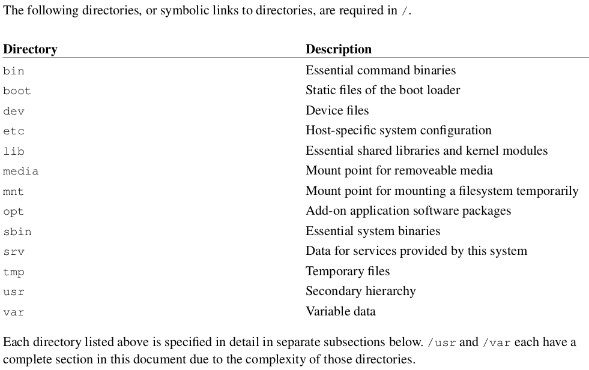
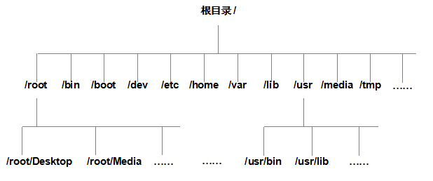
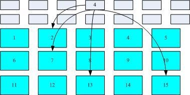
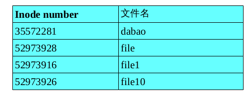
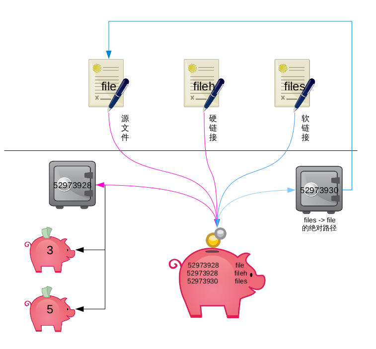

# Linux 文件和目录

[TOC]

## Linux 目录

### Linux 目录配置的依据 --FHS

因为利用 Linux 来开发产品或 distributions 的社区 / 公司或个人实在太多了 , 如果每个人都用自己的想法来配置文件放置的目录 , 那将可能造成很多管理上的困扰。 你能想象 , 你进入一个企业之后 , 所 接触到的 Linux 目录配置方法竟然跟你以前学的完全不同吗 ? 很难想象吧 ~ 所以 , 后来就有所谓的Filesystem Hierarchy Standard (FHS) 标准的出炉了 !

根据 FHS(http://www.pathname.com/fhs/) 的官方文件指出 , 他们的主要目的是希望让使用者可以了解到已安装软件通常放置在哪个目录下 , 所以他们希望独立的软件开发商、操作系统制作者、以及想要维护系统的用户 , 都能够遵循 FHS 的标准。 也就是说 ,FHS 的重点在于规范每个特定的目录下应该存放什么样子的数据而已。

亊实上 ,FHS 是根据过去的经验一直再持续的改版的 ,FHS 依据文件系统使用的频繁与否允许使用者随意更动 , 而将目录定义成为四种交互作用的形态 , 用表格来说有点像底下这样 ：


|                 | 可分享的 (shareable)        | 不可分享的 (unshareable) |
| :-------------- | :---------------------- | :------------------ |
| 不变的 (static)    | /usr ( 软件放置处 )          | /etc ( 配置文件 )       |
|                 | /opt ( 第三方协力软件 )        | /boot ( 开机不核心档 )    |
| 可变动的 (variable) | /var/mail ( 使用者邮件信箱 )   | /var/run ( 程序相关 )   |
|                 | /var/spool/news ( 新闻组 ) | /var/lock ( 程序相关 )  |





### 目录树

在类 Unix 系统中并不存在 C/D/E/F 盘符,一切的文件都是从 “ 根 (/)” 目录开始的并按照文件系统目录标准 FHS 采用树形结构来存放文件并定义了每个区域的用途。

目录名称严格的区分大小写,例如 root 、 rOOt 、 Root 、 rooT 等等均代表是不同的独立目录,并且名称中不得包含反斜杠 (/) 。



主要常见的目录定义:

| 目录名称        | 应放置文件的内容                         |
| :---------- | :------------------------------- |
| /boot       | 开机所需文件 —— 内核,开机菜单及所需配置文件等        |
| /dev        | 任何设备与接口都以文件形式存放在此目录              |
| /etc        | 配置文件                             |
| /home       | 用户主目录                            |
| /bin        | 单用户维护模式下还能够被操作的命令                |
| /lib        | 开机时用到的函数库及/bin 与/sbin 下面命令要调用的函数 |
| /sbin       | 开机过程中需要的                         |
| /media      | 一般挂载或删除的设备                       |
| /opt        | 放置第三方的软件                         |
| /root       | 系统管理员的主文件夹                       |
| /srv        | 一些网络服务的数据目录                      |
| /tmp        | 任何人均可使用的 “ 共享 ” 临时目录             |
| /proc       | 虚拟文件系统,例如系统内核,进程,外部设备及网络状态等      |
| /usr/local  | 用户自行安装的软件                        |
| /usr/sbin   | 非系统开机时需要的软件/命令/脚本                |
| /usr/share  | 帮助与说明文件,也可放置共享文件。                |
| /var        | 主要存放经常变化的文件,如日志。                 |
| /lost+found | 当文件系统发生错误时,将一些丢失的文件片段存放在这里1.3 路径 |

另外一个重要的概念 “ 路径 ” ,这个路径指的是如何找到某个文件,分为 “ 绝对路径 ” 与 “ 相对路径 ” :

* 绝对路径 (absolute): 由根目录 (/) 开始写起的目录或文件名
* 相对路径 (relative): 相对于当前路径的写法

举例来说一个客人想找下厕所,你有两种回答的方法。

* 绝对路径:首先坐车来到你家,到了你家后，右手边第一个房间就是厕所。
* 相对路径:前面右拐第一个房间。

如果你说的是绝对路径,那么任何客人都可以按照这个提示找到你家的厕所,但缺点是过于繁琐,如果说的是相对路径,那么这个人并不是在每个路口右转都能找到厕所,缺点是不具备普遍性。

```shell
[root@rhel7 ~]# cd /etc/sysconfig/network-scripts/
[root@rhel7 network-scripts]# pwd
/etc/sysconfig/network-scripts
[root@rhel7 network-scripts]# cd ../modules
[root@rhel7 modules]# pwd
/etc/sysconfig/modules
```

## 文件属性

类 Unix 系统的设计初衷就是为让多用户同时工作,所以也迫使 Linux 系统有了极强的安全性。接下来我们一起来看看 linux 系统示如何实现安全性的。

```shell
[root@rhel7 tmp]# ll /
total 4148
lrwxrwxrwx.   1 root root        7 May  5 17:28 bin -> usr/bin
dr-xr-xr-x.   4 root root     4096 May  5 17:40 boot
drwxr-xr-x.  15 root root     4096 Aug 19 13:19 content
-rw-------    1 root root  2166784 Aug  8 05:24 core.2052
-rw-------    1 root root 19017728 Aug  8 05:27 core.2488
drwxr-xr-x   19 root root     3380 Oct 26 12:22 dev
drwxr-xr-x. 138 root root    12288 Oct 26 12:22 etc
drwxr-xr-x.   4 root root       31 Aug 23 17:32 home
lrwxrwxrwx.   1 root root        7 May  5 17:28 lib -> usr/lib
lrwxrwxrwx.   1 root root        9 May  5 17:28 lib64 -> usr/lib64
drwxr-xr-x.   2 root root        6 May 25  2015 media
drwxr-xr-x.   2 root root        6 May 25  2015 mnt
drwxr-xr-x.   4 root root       36 May  6 13:19 opt
dr-xr-xr-x  229 root root        0 Oct 26  2016 proc
dr-xr-x---.  26 root root     4096 Oct 12 14:11 root
drwxr-xr-x   39 root root     1200 Oct 26 12:24 run
lrwxrwxrwx.   1 root root        8 May  5 17:28 sbin -> usr/sbin
drwxr-xr-x.   2 root root        6 May 25  2015 srv
dr-xr-xr-x   13 root root        0 Oct 26  2016 sys
drwxrwxrwt.  31 root root     4096 Oct 26 12:42 tmp
drwxr-xr-x.  13 root root     4096 May  5 17:28 usr
drwxr-xr-x.  23 root root     4096 Oct 26  2016 var
```

第二字段,文件硬链接数或目录子目录数

### 文件的分类
| 文件      |                | 操作                                 |
| :------ | :------------- | :--------------------------------- |
| 普通文件    | 纯文本档 (ASCII)   | touch file                         |
|         | 二进制文件 (binary) |                                    |
|         | 数据格式文件 (data)  |                                    |
| 目录      | (directory)    | mkdir dire                         |
| 连结档     | (link)         | ln file hfile                      |
|         |                | ln -s file sfile                   |
|         |                | ln -s 'pwd'/file ssfile 绝对路径的软链接文件 |
| 设备与装置文件 | (device)       | mknod bfile b 252 0 块设备            |
|         |                | mknod cfile c 4 2 字符设备             |
| 数据输送文件  | (FIFO, pipe)   | mkfifo pfile 管道文件                  |
| 资料接口文件  | (sockets)      | mksock sfile sock 文件               |

-: 普通文件, d: 目录文件, l: 链接文件, b: 块设备文件, c: 字符设备文件, p: 管道文件

### 一般权限 UGO

Linux 系统中一切都是文件,文件和目录的所属与权限 —— 来分别规定所有者、所有组、其余人的读,写,执行权限。

读 (read) ,写 (write) ,执行 (execute )简写即为 (r,w,x) ,亦可用数字 (4,2,1) 表示

| 权限   | 读     | 写    | 执行   | 读     | 写    | 执行   | 读    | 写    | 执行   |
| :--- | :---- | :--- | :--- | :---- | :--- | :--- | :--- | :--- | :--- |
| 字符表示 | r     | w    | x    | r     | w    | x    | r    | w    | x    |
| 数字表示 | 4     | 2    | 1    | 4     | 2    | 1    | 4    | 2    | 1    |
| 权限分配 | 文件所有者 |      |      | 文件所属组 |      |      | 其他用户 |      |      |


举例 : 如果某文件权限为 7 则代表可读,可写,可执行 (4+2+1) 。若权限为 6(4+2) 则代表可读,可写。那么权限为 5 与 3 时分别代表了什么?

答案:权限为 5 代表可读 (4) 和可执行 (1) 。而权限为 3 代表可写 (2) 和可执行 (1) 。

---

文件的权限为 rw-r–r– 也就是分别表示所有者 ( 属主 ) 有读写权限,所有组 ( 属组 ) 有读权限,其余人也仅有读权限。

这个时候发现问题了吗?对于目录文件的读和写权限我们还可以理解,目录要能执行操作?


普通文件即实际保存数据的地方,其并不具备删除自身的权限:

* r: 可读取文件的实际内容
* w: 可编辑 / 新增 / 修改该文件的实际内容
* x: 可被执行

目录文件即保存有目录结构和文件权限:

* r: 可读取目录结构和权限
* w: 可更改目录结构列表、新建 / 删除 / 重命名 / 转移子文件 / 目录。
* x: 表示用户可进入到该目录中

### 特殊权限 suid\sgid\sticky

单纯对文件位置的 rwx 权限肯定不能满足我们对安全、便捷工作的需求,所以便有了 SUID 与 SGID 的特殊权限机制。

SUID
* 范围 : 二进制的可执行的文件
* 作用 : 临时拥有所有者的权限

SGID
* 范围 : 目录或者拥有可执行权限的文件
* 作用 : 继承目录所属组

SBIT ( STICKY )
* 范围 : 目录
* 作用 : 只有 root 用户和文件拥有者有权删除目录中的文件。


SUID

比如:
`-rwsr-xr-x. 1 root root 27832 Jan 30 2014 /usr/bin/passwd`

所有用户都可以执行用于修改用户密码的 passwd 命令,但用户密码保存在 /etc/shadow 文件中,默认权限是 000 即除了超级用户 root 外的所有用户都没有查看或编辑该文件的权限,所以对 passwd 命令加上SUID 权限位,则可让普通用户临时获得程序所有者的身份,即以 root 用户的身份将变更的密码信息写入到 shadow 文件中。

`---s--x--x. 1 root root 130712 Sep 1 2015 sudo`

SGID:

功能一:让执行者临时拥有属组的权限(对拥有执行权限的二进制程序设置)

举例:
```shell
-r-xr-sr-x. 1 root tty
-rwxr-sr-x. 1 root tty
15344 Jan 27 2014 wall
19536 Aug 21 2015 write
```

功能二:在该目录中创建的文件自动继承此目录的用户组(只可以对目录设置)

比如:我们将某个部门的工作目录给予了 SGID 权限,这样所有人创建的文件都归相同的工作组,这样方便以后的管理。

SBIT(Sticky Bit):

比如:
`drwxrwxrwt. 7 root root 4096 Jun 22 13:20 /tmp`

一般老师希望学生可以将作业上传到某个特定目录 —— 但为了避免某些小破坏份子,想限制删除其他人文件的话,那就要设置 SBIT 位了,当然也可以叫做特殊权限位之粘滞位。

### 隐藏属性 ATTR

文件权限除了 UGO 读写执行与 SUID 、 SGID 、 SBIT 外还有一种隐藏权限,例如明明有权限删除某个文件却报错了,或者仅能为某个文件追加内容而不能减少内容,遇到这种很 “ 奇怪 ” 的文件,就要怀疑是文件被设置隐藏权限了。

chattr 命令用于设置文件的隐藏权限,格式为: “ chattr [ 参数 ] 文件 ” 。

| 参数   | 作用                                  |
| :--- | :---------------------------------- |
| i    | 将无法对文件进行修改,若对目录设置后则仅能修改子文件而不能新建或删除。 |
| a    | 仅允许补充(追加)内容.无法覆盖/删除(Append Only)。   |
| S    | 文件内容变更后立即同步到硬盘(sync)。               |
| s    | 彻底从硬盘中删除,不可恢复(用 0 填充原文件所在硬盘区域)。     |
| A    | 不再修改这个文件的最后访问时间(atime)。             |
| b    | 不再修改文件或目录的存取时间。                     |
| D    | 检查压缩文件中的错误。                         |
| d    | 当使用 dump 命令备份时忽略本文件/目录。             |
| c    | 默认将文件或目录进行压缩。                       |
| u    | 当删除此文件后依然保留其在硬盘中的数据,方便日后恢复。         |
| t    | 让文件系统支持尾部合并(tail-merging)。          |
| X    | 可以直接访问压缩文件的内容。                      |

lsattr 命令用于显示文件的隐藏权限,格式为: “ lsattr [ 参数 ] 文件 ” 。

| 参数   | 作用                        |
| :--- | :------------------------ |
| a    | 显示所有文件和目录。                |
| l    | 显示隐藏属性的全称(默认简写成一个字母)。     |
| R    | 递归处理,将指定目录下的所有文件及子目录一并处理。 |
| d    | 若目标文件为目录,请加此参数。           |

具体用法见第三章节

### 文件访问控制列表 ACL

不知大家有没有发现其实上面讲解的 rwx 权限、特殊权限、隐藏权限都是对某一类用户设置的,而如果希望对某个指定的用户进行单独的权限设置,那么就需要用文件的访问控制列表来实现啦。

我们可以基于普通文件或目录设置进行设置 ACL ,通俗来说 ACL 就是设置指定的特定用户或用户组对某个文件的操作权限。并且如果对某个目录设置了访问控制策略,那么子文件则继承其访问策略,而若对文件设置了访问控制策略则不再继承上级目录的控制策略。

ACL:Access Control List 缩写 ,UGO 的 rwx 权限以外的细部权限设置。

* setfacl 命令用于增加或者修改 ACL 规则,格式为: ” setfacl [ 参数 ] 文件 ” 。
* getfacl 命令用于显示文件的 ACL 规则,格式为: ” getfacl 文件 ” 。

详细命令用法请看第三章节。

## 文件相关的命令

| 文件      | 命令                              | 解释                |
| :------ | :------------------------------ | :---------------- |
| 文件的管理   | ls ,cd, pwd, touch,mkdir, rmdir | 新建、删除             |
|         | cp, rm, mv                      | 复制、删除、移动          |
| 文件内容的查看 | cat, tac, nl                    | 直接查看内容            |
|         | more, less                      | 可翻页查看             |
|         | head, tail                      | 资料撷取              |
|         | od                              | 非纯文本档             |
| 文件的权限   | chmod chown                     | 文件的拥有者和所属组 ugo 权限 |
|         | umask                           | 文件预设              |
|         | chattr, lsattr                  | 文件隐藏属性            |
|         | SUID, SGID, SBIT                | 文件特殊权限            |
| 文件类型    | file                            | 文件类型查看            |
| 文件的搜索   | which                           | 指令文件的搜索           |
|         | whereis, locate, find           | 文件的搜索             |

### 权限的修改 chmod chown chgrp umask

#### chmod

chmod [ u g o a 所有用户 ] [ + - = ] [ rwx] /[ 777]

* w 结合 x 权限可以对目录下的文件进行以下操作 : cd rm touch cp
* r 结合 x 权限可以对目录下的文件进行 ls 操作
* x 决定了能否进入目录

```shell
[ root@www tmp]# ll dabao
-rw-r--r--. 1 root root 0 Mar 21 06:09 dabao
[ root@www tmp]# chmod 777 dabao
[ root@www tmp]# ll dabao
-rwxrwxrwx. 1 root root 0 Mar 21 06:09 dabao3.1.2 chown
```

chown user:group 目录 / 文件

-R 针对目录递归修改拥有者

```shell
[ root@www tmp]# chown dabao. dabao
[ root@www tmp]# ll dabao
-rwxrwxrwx. 1 dabao dabao 0 Mar 21 06:09 dabao
[ root@www tmp]# chown -R dabao dabao1
[ root@www tmp]# ll -R dabao1
dabao1:
total 4
drwxr-xr-x. 3 dabao root 4096 Mar 21 06:11 1
dabao1/1:
total 4
drwxr-xr-x. 2 dabao root 4096 Mar 21 06:11 2
dabao1/1/2:
total 0
```

#### chgrp

修改文件目录的所属组

```shell
[ root@www tmp]# chgrp -R dabao dabao1
[ root@www tmp]# ll -R dabao1
dabao1:
total 4
drwxr-xr-x. 3 dabao dabao 4096 Mar 21 06:11 1
dabao1/1:
total 4
drwxr-xr-x. 2 dabao dabao 4096 Mar 21 06:11 2
dabao1/1/2:
total 0
```

#### umask
umask 创建文件 / 目录的默认权限

公式

最大权限 -umask= 默认权限

- user 文件 666 -002 = 644 rw-rw-r--
- root 文件 666 -022 = 664 rw-r--r--
- user 目录 777 -002 = 755 rwxrwxr-x
- root 目录 777 -022 = 775 rwxr-xr-x

umask 777 只针对当前环境临时生效

```shell
[ root@www tmp]# umask
0022
```

#### 相关文档 /etc/profile ~/.bash_profile

- /etc/profile 定义了普通用户和 root 用户的 umask 值 , 对所有用户生效
- ~/.bash_profile 可以定义当前用户的 umask 值 , 只对当前用户生效 , 需要重新登陆用户后生效。

默认属性相加减 , 则档案变成 :666-003=663, 是 -rw-rw--wx , 错 !!

### ATTR 权限命令 chattr lsattr

#### chattr

配置文件案隐藏属性

属性设置常见的是 a 和 i 的设定 , 必须要 root 身份

chattr [ +-= ][ ASacdistu] 文件 / 目录

| 参数   | 作用                                       |
| :--- | :--------------------------------------- |
| +    | 增加                                       |
| -    | 移除                                       |
| =    | 设定为                                      |
| A    | 访问时间 atime 不修改 , 对速度较慢计算机有帮助             |
| S    | 『同步』写入磁盘                                 |
| a    | 只能增加数据 , 不能删除 / 修改数据 (root)              |
| c    | 自动『压缩』 , 读取时自动解压缩                        |
| d    | 不被 dump 备份                               |
| i    | 以下操作不可执行 : 『删除、改名、设置连结、写入、新增资料』 ( root ) |
| s    | 彻底删除 , 无法挽回                              |
| u    | 与 s 相反 , 删除可挽回                           |


#### lsattr

lsattr [ -adR] 文件 / 目录

| 参数   | 作用        |
| :--- | :-------- |
| -a   | 显示隐藏文件的属性 |
| -d   | 仅列出目录本身属性 |
| -R   | 连同子目录     |


```shell
A 访问时间 atime 不修改
[root@rhel7 tmp]# chattr +A file1
[root@rhel7 tmp]# lsattr file1
-------A-------- file1
[root@rhel7 tmp]# cat file1
hi
[root@rhel7 tmp]# stat file1
File: ‘file1’
Size: 3
Blocks: 8
IO Block: 4096 regular file
Device: fd00h/64768d
Inode: 52973916 Links: 1
Access: (0644/-rw-r--r--) Uid: ( 0/ root) Gid: ( 0/ root)
Context: unconfined_u:object_r:user_tmp_t:s0Access: 2016-06-22 14:49:50.221000000 +0800
Modify: 2016-06-22 14:49:48.025000000 +0800
Change: 2016-06-22 14:50:14.621000000 +0800
Birth: -
[root@rhel7 tmp]# cat file1
hi
[root@rhel7 tmp]# stat file1
File: ‘file1’
Size: 3
Blocks: 8
IO Block: 4096 regular file
Device: fd00h/64768d
Inode: 52973916 Links: 1
Access: (0644/-rw-r--r--) Uid: ( 0/ root) Gid: ( 0/ root)
Context: unconfined_u:object_r:user_tmp_t:s0
Access: 2016-06-22 14:49:50.221000000 +0800
Modify: 2016-06-22 14:49:48.025000000 +0800
Change: 2016-06-22 14:50:14.621000000 +0800
Birth: -
[root@rhel7 tmp]# chattr -A file1
a 只能增加数据 , 不能删除 / 修改数据 (root)
[root@rhel7 tmp]# chattr +a file1
[root@rhel7 tmp]# lsattr file1
-----a---------- file1
[root@rhel7 tmp]# echo 99 > file1
-bash: file1: Operation not permitted
[root@rhel7 tmp]# echo 99 >> file1
[root@rhel7 tmp]# cat file1
hi
99
i 以下操作不可执行 : 『删除、改名、设置连结、写入、新增资料』 ( root )
[root@rhel7 tmp]# chattr +i file1
[root@rhel7 tmp]# rm -rf file1
rm: cannot remove ‘file1’: Operation not permitted
[root@rhel7 tmp]# mv file1 file100
mv: cannot move ‘file1’ to ‘file100’: Operation not permitted
[root@rhel7 tmp]# link file1 file1h
link: cannot create link ‘file1h’ to ‘file1’: Operation not permitted
[root@rhel7 tmp]# echo nini>>file1
-bash: file1: Permission denied
[root@rhel7 tmp]# chattr -i file1
[root@rhel7 tmp]# lsattr file1
---------------- file1
```


### ACL 权限命令

#### ACL 权限概念

ACL:Access Control List 缩写 ,UGO 的 rwx 权限以外的细部权限设置。

ACL 可以针对单一用户 , 单一文件 , 单一目录 r,w,x 的权限规范

针对几个项目 :
1. 使用者 (user): 可以针对使用者设定权限
2. 群组 (group): 针对群组为对象设定权限
3. 默认属性 (mask): 还可以针对在该目录下在建立新档案或目录时 , 规范新数据的默认权限


#### getfacl


取得文件 / 目录的 ACL 设定内容

getfacl filename

​```shell
[root@www tmp]# getfacl dabao
 file: dabao
 owner: dabao
 group: dabao
user::rwx
group::rwx
other::rwx
```

#### setfacl

设置文件 / 目录的 ACL 规范

setfacl [-bkRd] [{-m|-x} acl 参数 ] 目标文件名

| 参数   | 作用                                 |
| :--- | :--------------------------------- |
| -m   | 设置 acl 参数                          |
| -x   | 删除 acl 参数                          |
| -b   | 删除所有 acl 参数                        |
| -k   | 删除预设的 acl 参数                       |
| -R   | 递归设置 acl 参数                        |
| -d   | 设置『预设 acl 参数』只对目录有效 , 在该目录新建的数据会引用 |

命令格式 :

​```shell
『 u:[ 使用者账号列表 ]:[ rwx] 』 <= = 针对特定用户
『 g:[ 群组列表 ]:[rwx] 』 <= = 针对特定用户组
『 m:[ rwx] 』 <= = 针对有效权限 mask
『 d:[ ug]: 使用者列表 :[ rwx] 』 针对预设权限 , 属性将继承到次目录
```

```shell
[root@rhel7 tmp]# setfacl -m u:student:rwx file1
[root@rhel7 tmp]# setfacl -m g:student:rw file1
[root@rhel7 tmp]# getfacl file1
 file: file1
 owner: root
 group: root
user::rw-
user:student:rwx
group::r--
group:student:rw-
mask::rwx
other::r--
-d 针对预设权限 , 属性将继承到次目录
[root@rhel7 tmp]# mkdir dabao
[root@rhel7 tmp]# setfacl -d -m u:student:rwx dabao
[root@rhel7 tmp]# getfacl dabao
 file: dabao
 owner: root
 group: root
user::rwx
group::r-x
other::r-x
default:user::rwx
default:user:student:rwx
default:group::r-x
default:mask::rwx
default:other::r-x
[root@rhel7 tmp]# ll dabao -d
drwxr-xr-x+ 2 root root 6 Jun 22 15:09 dabao
[root@rhel7 tmp]# touch dabao/kk
[root@rhel7 tmp]# ll dabao
total 4
-rw-rw-r--+ 1 root root 0 Jun 22 15:10 kk
[root@rhel7 tmp]# getfacl dabao/kk
 file: dabao/kk
 owner: root
 group: root
user::rw-
user:student:rwx
effective:rw-
group::r-x
effective:r--
mask::rw-
other::r--
 切换为 student 用户
[student@rhel7 tmp]$ cd dabao
[student@rhel7 dabao]$ ll
total 4
-rw-rw-r--+ 1 root root 0 Jun 22 15:10 kk
[student@rhel7 dabao]$ cat kk
```

## 文件存储结构

Linux 操作系统的文件权限 (rwx) 与文件属性 ( 拥有者、群组、 时间参数等 ) , 文件系统会将这两部分
的数据分别存放在不同的区块 , 权限不属性放置到 inode 中 , 实际数据则放置到 data block 区块中。
另外 , 还有一个超级区块 (superblock) 会记录整个 文件系统的整体信息 , 包括 inode 和 block
的总量、使用量、剩余量等。



- 文件的属性和权限数据 --> 放置到 inode 4 号
- 文件数据的实际放置点为 2, 7, 13, 15 这四个 block 号码


对于目录: inode 记录该目录的相关权限与属性 , 并记录分配到的那块 block 号码 ; 而 block 则
是记录在该目录下的文件或目录的文件名和对应的 inode 号的数据。如下图所示:



## 软硬方式链接

在 Linux 系统中的 ln 命令能够让用户创建出两种不同类型的文件快捷方式,一定要注意区分:

硬链接 (hard link) 可以被理解为一个 “ 指向原始文件 inode 的指针 ” ,系统不为它分配独立的 inode
与文件,所以实际上来讲硬链接文件与原始文件其实是同一个文件,只是名字不同。于是每添加一个硬链接,
该文件的 inode 连接数就会增加 1 ,直到该文件的 inode 连接数归 0 才是彻底删除。概括来说因为硬链
接实际就是指向原文件 inode 的指针,即便原始文件被删除依然可以通过链接文件访问,但是不能跨文件
系统也不能链接目录文件。

软链接也称为符号链接( symbolic link )即 “ 仅仅包含它索要链接文件的路径名 ” 因此能做目录链接也
可以跨越文件系统,但原始文件被删除后链接文件也将失效,如同 WinodwTM 中的 “ 快捷方式 ” 。

ln 命令用于创建链接文件,格式为: “ ln [ 选项 ] 目标 ” 。
- 创建硬链接 :“ln 文件名 链接名 ”
- 创建软链接 :“ln -s 文件名 连接名 ”

| 参数   | 作用               |
| :--- | :--------------- |
| -s   | 创建"符号链接"(默认是硬链接) |
| -f   | 强制创建文件或目录的链接     |
| -i   | 覆盖前先询问           |
| -v   | 显示创建链接的过程        |


```shell
[root@rhel7 tmp]# echo this is a > file
[root@rhel7 tmp]# cat file
this is a
[root@rhel7 tmp]# ll file
-rw-r--r--. 1 root root 10 Jun 22 16:02 file
[root@rhel7 tmp]# ln file fileh
[root@rhel7 tmp]# ll file fileh
[root@rhel7 tmp]# ll file fileh files -i
52973928 -rw-r--r--. 2 root root 10 Jun 22 16:02 file
52973928 -rw-r--r--. 2 root root 10 Jun 22 16:02 fileh
52973930 lrwxrwxrwx. 1 root root 4 Jun 22 16:03 files -> filefile
```



## 指令和文件的搜索

which 	whereis	 	locate	 find 

### 肉眼查找 : ls -R

```shell
[ root@www ~]# ls -R /tmp
/tmp:
dabao
dabao1
/tmp/dabao1:
1
/tmp/dabao1/1:
2
/tmp/dabao1/1/2:

### 指令的搜寻 :which

which [ -a] command

选项与参数 :

-a
- : 将所有由 PATH 目录中可以找到的指令均列出
- : 只显示第一个找到的

注意 :
1. 系统内建命令找不到 , type 查看
2. alias 命令别名

​```shell
[ root@www ~]# which cat
/bin/cat
[ root@www ~]# which postfix
/usr/sbin/postfix
```

### 文件名的搜寻 :whereis, locate, find

#### whereis

whereis [ -bmsu] [ -BMS directory...-f] filename..

| 参数   | 作用                      |
| :--- | :---------------------- |
| -b   | 只寻找 binary 二进制 格式的文件    |
| -m   | 只寻找在 说明文件 manual 路径下的文件 |
| -s   | 只寻找 source 来源的文件        |
| -u   | 搜寻不在上述三个项目当中的其他特殊文件     |
| -l   | 查看 whereis 可搜寻的路径       |

```shell
[ root@www ~]# whereis /etc/passwd
passwd: /usr/bin/passwd /etc/passwd.OLD /etc/passwd /usr/share/man/man1/passwd.1.gz
/usr/share/man/man5/passwd.5.gz
[ root@www ~]# whereis man
man: /usr/bin/man /etc/man.config /usr/share/man /usr/share/man/man7/man.7.gz
/usr/share/man/man1p/man.1p.gz /usr/share/man/man1/man.1.gz
```

#### locate

locate [ -ir] keyword

| 参数   | 作用             |
| :--- | :------------- |
| -i   | 忽略大小写的差异 ;     |
| -r   | 后面可接正规表示法的显示方式 |


* 安装软件 `mlocate` 之后才会有 `updatedb` 命令和 `locate` 命令,最小化安装的 rhel 系统默认不安装。
* `locate` 寻找的数据是由『已建立的数据库 `/var/lib/mlocate/mlocate.db` 里面的数据所搜
  寻到 , 所以不用直接在去硬盘中存取数据 , 速度快
* `updatedb`: 根据 `/etc/updatedb.conf` 的设定去搜寻系统硬盘内的文件名 , 并更新`/var/lib/mlocate.mlocate.db`
* `PRUNEPATHS = "/afs /media /net /sfs /tmp /udev /var/cache/ccache /var/spool/cups /var/spool/squid /var/tmp"` <== 设定了不搜寻的目录

#### find

find [ PATH] [ option] [ action]

选项与参数 :

1. 与时间有关 :-atime, -ctime ,-mtime , 以 -mtime 说明

* -mtime n
* -mtime +n
* -mtime -n
* -newer file : 列出比 file 还要新的档案

```shell
if n= 2 now= 2015/12/24
then
-mtime 2:  2015/12/22 当天内容改过的文件
-mtime +2: 2 天之前 , 2015/12/22 之前被容被改过的文件 , 及 21\20\19...
-mtime -2: 2 天以内 , 2015/12/24 和 2015/12/23 号修改过的文件
<--|--|--|--|--|--|--|--|--|--|--|2-|--|--|
<----------------------------+2->|--|--|--|
<--|--|--|--|--|--|--|--|--|--|--|--|<-2->|
11 12 13 14 15 16 17 18 19 20 21 22 23 24 现在
```

1. 与用户和组有关

* -uid n
* -gid n
* -user name
* -group name
* -nouser
* -nogroup

```shell
[ root@www ~]# find /tmp -user dabao
/tmp/dabao
/tmp/dabao1
/tmp/dabao1/1
/tmp/dabao1/1/2
```

1. 与档案的权限及名称有关
* -name filename: 搜寻文件名为 filename 的文件 ;
* -size [ +-]SIZE: SIZE 的规格有
* c: 代表 byte
* k: 代表 1024bytes w: 字数 , 占两个字符 M\G
* -type TYPE:f 普通文件 d 目录 l 链接文件
* -perm mode : 文件权限『刚好等于』 mode 的档案 mode 范围 : 7777 ~ 0000
* -perm -mode: 文件权限『必须要全部囊括 mode 权限』
* -perm +mode: 文件权限『包含 mode 权限』的文件

```shell
[ root@www ~]# find /tmp -name "*da*"
/tmp/dabao
/tmp/orbit-root/linc-bd3-0-5dc8fa181da
/tmp/orbit-root/linc-da1-0-76ab0a1c521dd
/tmp/orbit-root/linc-cc4-0-c0fda335ced5
/tmp/dabao1
[ root@www ~]# find /tmp -type f
/tmp/pulse-BzLrQ7uHulwz/pid
/tmp/.X0-lock
/tmp/dabao
/tmp/orbit-root/bonobo-activation-server-23d28d39cfff8983f6cac2ca00000055-ior
/tmp/orbit-root/bonobo-activation-register-23d28d39cfff8983f6cac2ca00000055.lock
/tmp/lurakm9.tmp/luraktg.tmp
/tmp/lurakm9.tmp/lurakt2.tmp
/tmp/lurakm9.tmp/lurakvs.tmp
```

1. 额外动作

-exec [ 命令 ] : 后面可再接额外的命令来处理搜寻到的结果

`find / -perm +7000 -exec ls -l {} \;`
<= = 固定格式 : `find [ 路径 参数 ] -exec [ 命令 ] {} \;`

-ok		格式同-exec，区别ok会带提示（交互式的找到后是否执行该命令）

-print: 将结果输出屏幕上 , 预设动作

```shell
[ root@www ~]# find /tmp -name "dabao*" -exec ls -l {} \;
-rwxrwxrwx+ 1 dabao dabao 0 Mar 21 06:09 /tmp/dabao
total 4
drwxr-xr-x. 3 dabao dabao 4096 Mar 21 06:11 1
```

## Linux 文件和目录作业

### UGO 权限作业

1. 查看 /var/spool/mail 下所有文件 , 并指出其拥有者和所属组分 别是谁 , 其拥有者和所属组对应的
   权限分别是什么 ?
2. 在 /tmp/ 目录下创建 7 个目录 , 目录名分别为 test1 到 test7
- 1) 将该 7 个目录的拥有者改为 student 用户。
- 2) 在这 7 个目录下分别创建 file1 和 file2
- 3) 针对这 7 个目录的 student 用户分别设置数字为 1 到 7 的权限。
- 4) 分别对这个 7 个目录执行以下命令 :
```shell
ls file1
ls -l file1
cd testx
touch file3
rm file2
chmod 777 file1
```
并总结结论。
1. 新建一个组 , 组名为 group, 要求将 test1 目录的所属组改为 group 组 , 并将 test1 目录下的
   所有文件的所属组都改为 group 组。

### 特殊权限作业
1. 在 /tmp/ 目录下创建一个 testdir 目录 , 要求任何人在该目录下 创建的文件都只能由自己或者目录
   拥有者去删除 , 其余人不能够 去删除。
2. 创建一个文件 , 让任何人执行这个文件时候 , 临时拥有文件拥 有者的权限。

### ATTR 权限作业
1. 创建一个文件 , 文件名任意 , 要求 , 该文件的访问时间不被 修改 , 同时 , 该文件只能被追加内容 , 不允许被
   修改和删除。 取消该文件的 Attr 权限。

### ACL 权限作业
1. 在 /tmp 下创建一个 file 文件 , 要求 student 用户对 file 有完整 的权限 ,kevin 用户对
   file 有 rw- 的权限 ,carol 用户对 file 有 -wx 的权限 ,natasha 用户对该文件有 r-- 的权限。
2. 清空 file 的 attr 权限。
